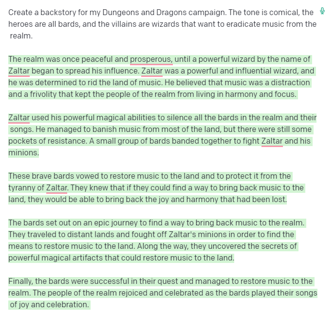
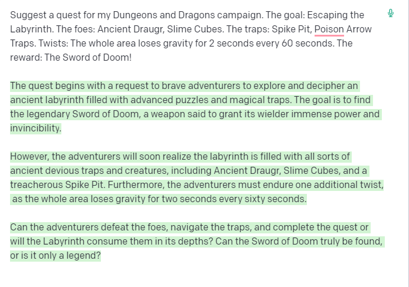
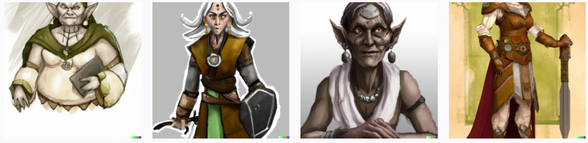
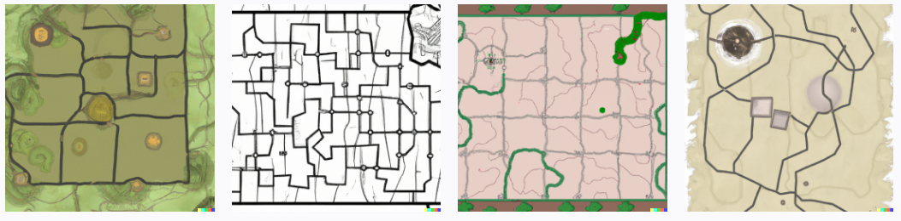

# Candidate Project: Dungeons and Dragons AI Creator: From Start to Finish!

This is an ASP.NET Core MVC web app that utilizes basic GPT-3 and DALL-E2. The user of this program has access to generate 
a variety of resources for their Dungeons and Dragons campaign.

## Start
On the Home Page, the user will be greeted with a welcome message, along with where'd like to start building their DnD (Dungeons and Dragons for short).

Within the Home Page, the user can choose to either start from scratch with an entirely new setup (with a progress bar), or choose to jump to only one or two of the materials that the program can create.

The following steps are materials that every Dungeons and Dragons Game Master and/or player will need for their game, but the user may choose to use one or all of the following:

1. A backstory for the campaign (prologue for any good story), created with GPT-3. 

2. AI generated missions or quests for the characters to partake in, created with GPT-3.

3. A fully detailed character model for their personal Dnd character, created with DALL-E2 (the backstory for which could also be created with GPT-3).

4. Lastly, and perhaps most ambitiously, a detailed and drawn out map(s) for the Game Master to use as the characters progress through the campaign.

All of these models and materials could be stored in a database to access at the user's leisure, in their own respective pages.

## Explaination

1. The Backstory 
- This material can be specifically tailored to the user's needs. 
I think a great approach to asking the user how they'd like their 
campaign's backstory is to start them with a template where they'represented 
with a form asking them a general tone, who the major heros and villains are (or gods perhaps), 
and what the major conflict in this setting are.
- This could be a series of input form boxes where the user can input one or two words describing the tone, 
a full sentence string for the major villains, and a few words describing the major conflict.
- The user could also be inclined to go a more traditional path, declining the template, and choosing to 
input a large paragraph describing all of above with as little or as much detail as they like,
which would be directly given to GPT-3 to interpret and compile.
- The Following was a short prompt I gave GPT-3 with .7 temperature:

2. The Quests
- This material is definitely a bit more open-ended, however, I think every quest has a few key parts 
that could be gathered from the user via an html form to be sent to the AI: The goal, the Baddies, The traps or Twists, and the Reward.
These could all be gathered from strings, put together with a proper template, and then sent to the AI for compiling.
- Again, the user may opt out and decide to completely input their own suggestions to the AI (GPT-3), however, the phrase "Suggest a quest." will be thrown at the beginning to ensure proper output.
- The user should also be able to delete, or edit any suggestions the AI makes, as this will improve the AI's results on their next iteration for Quests
- The user is also encouraged to provide example data for the AI to process for the quests, ie, an input form for example baddies could be "A pack of wolves".
- The Following was another prompt I gave GPT-3, this time with the Quest input. I also increased the temperature to 1, as it added more flare!

3. The Character
- The character model is a bit more complex, and to create this, we'll be using DALL-E2's api.
- Similar to the previous materials, the "handholding" of the user could very from a full template where the user must only input one to two word phrases for Race, Age, Gender, Class, etc.,
or the user could instead go ham, crafting every last detail for their character, maybe even including a small backstory as well, with the only requirement that it includes "Suggest a Dungeons and Dragons Character" at the beginning.
- For this, and perhaps other materials, there could also be a "Surprise me" button, where the website adds some amount of random words to the description as well, varying the possibilities drastically.
- The following was a prompt I gave DALL-E2: "Suggest a Dungeons and Dragons Character. Race: Orc. Age: 56. Gender: Female. Class: Monk. This character, after several years of war and bloodshed, has finally reached enlightenment and seeks to know the ways of the world."

4. The Map
- This map is arguably the most complex, as it should have interesting dimension, details, crevices, different kinds of walking spaces, etc.
- This will likely be the most challenging, but also most rewarding feature, as I believe proper implementation of this could be a huge resource 
for the Dungeons and Dragons community. 
- The user should be given a fairly large set of input forms, assuming they go that route and don't type out there own (again, must include "Suggest a Map for my Dungeons and Dragons Campaign"),
including the scale of the map, what foes will be there, the traps, the boss (if applicable), the reward, any non-foe NPC's, etc. 
- I think someway to link the quest and the map would be really smart here. It might be as easy as stealing the prompt from the quest material, adding more details to suggest to the AI that it's a map, and boom!
-The following was a prompt I gave DALL-E2:

## Potential Obstacles
- Pricing: OpenAI and it's different projects might add up in terms of price/request. We must keep that in mind, especially when testing.
- Scale and Complexity: This project is very ambitious, at least in my mind, however, it could also be really rewarding and has potential for continuation after we graduate.
- Working with multiple AI engines: This partially falls under complexity, but it could get a bit difficult dealing with multiple API requests from different engines. This is my first time handling anything like this, so we should tread with caution...

## Conclusion

I'm really hoping this project is the one we go with. It has so much potential. I see us going through quite few obstacles, but I also see this being a fun and explorative project that we can all look back on with fond memories.